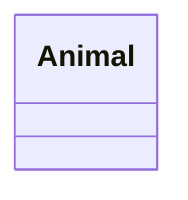

# UML図
## 書き方
https://mermaid-js.github.io/mermaid/#/./classDiagram

https://cacoo.com/ja/blog/how-to-write-class-diagram/

## 例



```mermaid
 classDiagram
 Animal <|-- Duck
 ```
 
 ```mermaid
 classDiagram
    Animal <|-- Duck
    Animal <|-- Fish
    Animal <|-- Zebra
    Animal : +int age
    Animal : +String gender
    Animal: +isMammal()
    Animal: +mate()
    class Duck{
        +String beakColor
        +swim()
        +quack()
    }
    class Fish{
        -int sizeInFeet
        -canEat()
    }
    class Zebra{
        +bool is_wild
        +run()
    }
```

```mermaid
classDiagram
  class Style {
    +layers: Layer[]
    +sources: Source[]
    +zoom: number
    +center: number[]
    +bearing: number
    +pitch: number
    +light: Light
    +sprite: string
    +glyphs: string
  }
  class Layer {
    +id: string
    +type: string
    +source: string
    +source-layer: string
    +minzoom: number
    +maxzoom: number
    +filter: any[]
    +layout: Layout
    +paint: Paint
  }
  class Source {
    +type: string
    +url: string
    +tiles: string[]
    +tileSize: number
    +bounds: number[]
    +coordinateTransform: function
  }
  class Layout {
    // specific layout properties depend on layer type
  }
  class Paint {
    // specific paint properties depend on layer type
  }
  class Light {
    +anchor: string
    +color: string
    +intensity: number
  }
  Style "1" -- "*" Layer
  Layer "0..*" -- "1" Source
  Layer "0..*" -- "1" Layout
  Layer "0..*" -- "1" Paint
  ```
