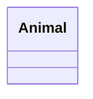

# UML図
## 書き方
https://mermaid-js.github.io/mermaid/#/./classDiagram

https://cacoo.com/ja/blog/how-to-write-class-diagram/

## 例



```mermaid
 classDiagram
 Animal <|-- Duck
 ```
 
 ```mermaid
 classDiagram
    Animal <|-- Duck
    Animal <|-- Fish
    Animal <|-- Zebra
    Animal : +int age
    Animal : +String gender
    Animal: +isMammal()
    Animal: +mate()
    class Duck{
        +String beakColor
        +swim()
        +quack()
    }
    class Fish{
        -int sizeInFeet
        -canEat()
    }
    class Zebra{
        +bool is_wild
        +run()
    }
```
