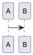
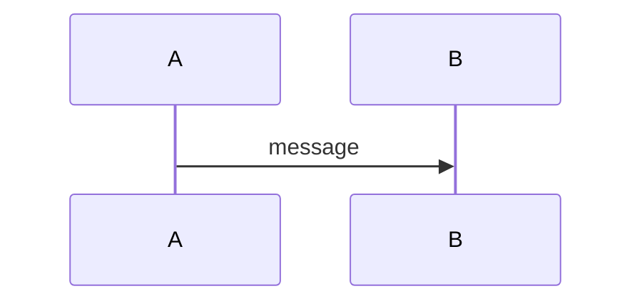
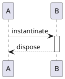
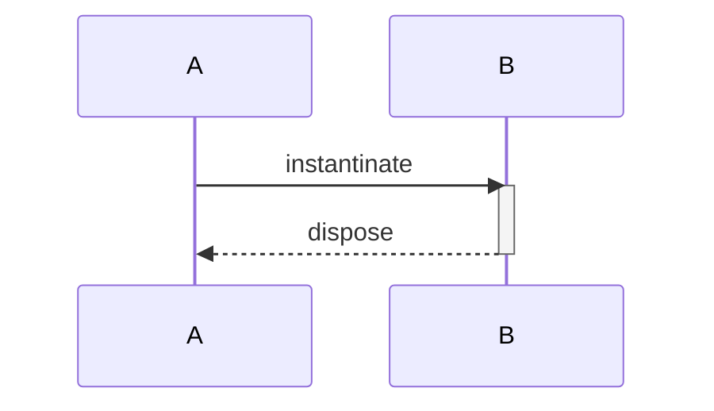
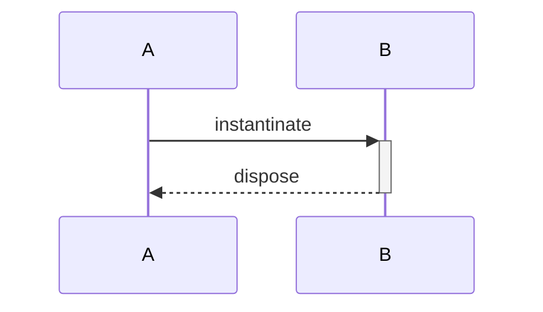
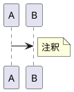
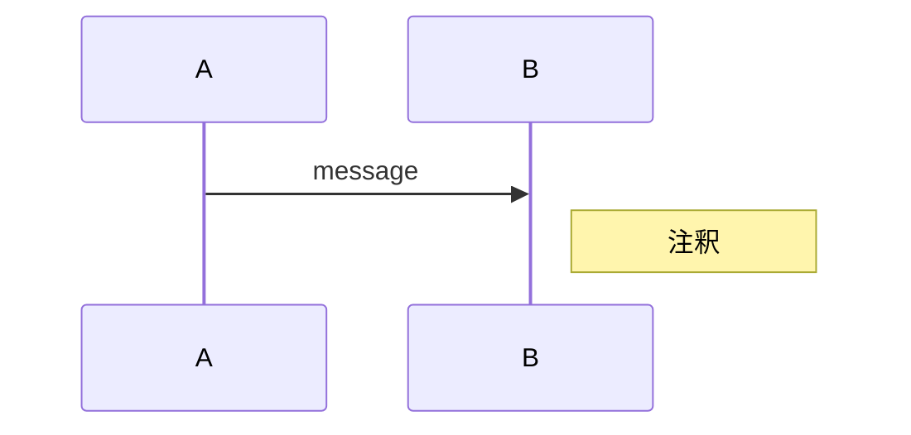

```puml
@startuml
A -> B
@enduml
```

```mermaid
sequenceDiagram
    A ->> B : message
```

```puml
@startuml
A -> B : instantinate
activate B
A <-- B : dispose
deactivate B
@enduml
```

```mermaid
sequenceDiagram
    A ->> B : instantinate
    activate B
    B -->> A : dispose
    deactivate B
```

```mermaid
sequenceDiagram
    A ->>  + B : instantinate
    B -->> - A : dispose
```

```puml
@startuml
/' 
    このコメントは描画されません
'/
' この行コメントは描画されません
A -> B
note right: 注釈
@enduml
```

```mermaid
sequenceDiagram
    % この行コメントは描画されません
    A ->> B : message
    Note right of B : 注釈
```
