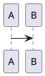
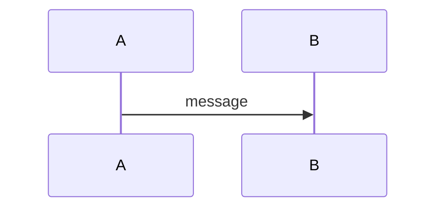
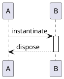
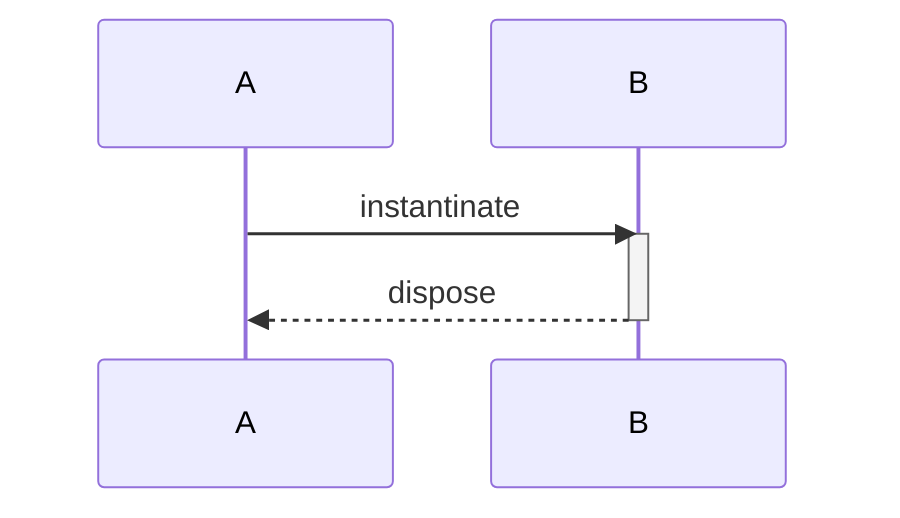
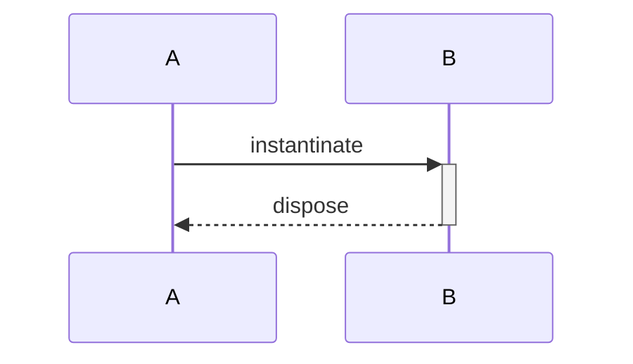

```puml
@startuml
A -> B
@enduml
```

```mermaid
sequenceDiagram
    A ->> B : message
```

```puml
@startuml
A -> B : instantinate
activate B
A <-- B : dispose
deactivate B
@enduml
```

```mermaid
sequenceDiagram
    A ->> B : instantinate
    activate B
    B -->> A : dispose
    deactivate B
```

```mermaid
sequenceDiagram
    A ->>  + B : instantinate
    B -->> - A : dispose
```
